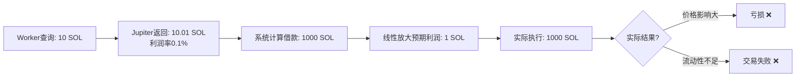

# 🚨 查询金额与借款金额不一致问题分析

## 问题描述

当前系统存在**查询金额（10 SOL）与实际借款金额（最高1000 SOL）不一致**的严重问题，导致利润预测不准确。

---

## 当前流程



---

## 根本原因

### 1. 价格影响非线性

| 金额 | 价格影响 | 说明 |
|-----|---------|------|
| 10 SOL | ~0.01% | 订单簿顶部，价格最优 |
| 100 SOL | ~0.1% | 开始吃掉深度 |
| 1000 SOL | ~2-5% | **大幅滑点，可能亏损** |

**Jupiter的 `estimatedOut` 只针对查询金额（10 SOL），不适用于放大100倍的场景！**

### 2. 流动性深度限制

- 小池子：可能只有50-200 SOL流动性
- 查询10 SOL：✅ 成功
- 借款1000 SOL：❌ 流动性不足，交易失败

### 3. 线性放大假设错误

```typescript
// ❌ 当前错误假设
profitRate = 0.01 SOL / 10 SOL = 0.1%
expectedProfit = 0.1% × 1000 SOL = 1 SOL  // 假设利润率不变

// ✅ 实际情况
小额利润率 ≠ 大额利润率
价格影响随金额指数级增长，不是线性！
```

---

## 实际案例

### 案例1：误认为有利润（最常见）

```bash
# Worker查询
10 SOL → USDC → SOL = 10.01 SOL (利润0.01 SOL, 0.1%)

# 系统预测（线性放大）
1000 SOL → USDC → SOL = 1001 SOL (预期利润1 SOL) ✅

# 实际执行结果
1000 SOL → USDC (价格影响-3%) → SOL = 995 SOL (亏损5 SOL) ❌

# 结果：系统认为有利润，实际亏损
```

### 案例2：流动性不足

```bash
# Worker查询（小池子）
10 SOL → JUP → SOL = 10.005 SOL (利润0.005 SOL, 0.05%)

# 系统计算借款
利润率0.05% < 0.1% → 借款 = 10 SOL × 50 = 500 SOL

# 实际执行
Pool流动性只有100 SOL → 交易失败 ❌
```

---

## 解决方案对比

### 方案1：使用实际借款金额查询（最准确）⭐

**优点**：
- ✅ 完全准确，避免所有误判
- ✅ Jupiter `estimatedOut` 直接反映真实价格影响
- ✅ 流动性深度验证更准确

**缺点**：
- ❌ API调用次数增加（从2次变为4次）：
  ```
  当前：10 SOL查询（2次） → 发现机会 → 验证
  优化：10 SOL查询（2次） → 发现机会 → 100 SOL二次查询（2次） → 验证
  ```
- ❌ 发现延迟增加（每个机会需要2倍API时间）
- ❌ 可能触发速率限制（RPS从4.6增至9.2）

**实施方式**：
```typescript
// 1️⃣ 第一阶段：小额查询（发现机会）
Worker查询: 10 SOL → 发现0.1%利润机会

// 2️⃣ 第二阶段：计算借款金额
borrowAmount = calculateOptimalBorrowAmount() = 1000 SOL

// 3️⃣ 第三阶段：大额二次查询（验证真实利润）
FlashloanBot二次查询: 1000 SOL → 获取真实利润
if (realProfit > fees) { 执行 }
```

---

### 方案2：使用接近借款金额的查询金额（折中）⭐⭐⭐

**优点**：
- ✅ 无需额外API调用
- ✅ 大幅提升准确性（10 SOL → 100 SOL）
- ✅ 实施简单，只需改1个数字

**缺点**：
- ⚠️ 仍有误差（查询100 SOL，实际借200-1000 SOL）
- ⚠️ 小机会可能被过滤（100 SOL查询可能找不到10 SOL能盈利的小机会）

**实施方式**：
```typescript
// 修改 flashloan-bot.ts 第193行
const queryAmount = 100_000_000_000; // 从10 SOL改为100 SOL

// 效果
Worker查询: 100 SOL → Jupiter返回真实价格影响
借款金额: 100-1000 SOL → 误差大幅减小
```

---

### 方案3：动态查询金额（最优）⭐⭐⭐⭐⭐

**优点**：
- ✅ 按利润率分级查询，兼顾准确性和效率
- ✅ 高利润率 → 大额查询（减少误判）
- ✅ 低利润率 → 小额查询（发现更多机会）
- ✅ API调用次数不变

**缺点**：
- ⚠️ 需要两阶段查询（类似方案1）

**实施方式**：
```typescript
// 阶段1：小额探测
Worker查询: 10 SOL → 发现0.5%利润

// 阶段2：根据利润率决定查询金额
if (profitRate > 0.3%) {
  // 高利润率：用大额查询验证（避免误判）
  二次查询: 500 SOL → 验证真实利润
} else {
  // 低利润率：直接执行（小额机会，误差可接受）
  执行: 50 SOL
}
```

---

## 推荐方案

### 🎯 立即实施：方案2（最快见效）

**修改1行代码**，将查询金额从10 SOL提升到100 SOL：

```typescript
// packages/jupiter-bot/src/flashloan-bot.ts:193
- const queryAmount = 10_000_000_000; // 10 SOL
+ const queryAmount = 100_000_000_000; // 100 SOL - 更接近实际借款规模
```

**预期效果**：
- ✅ 误判率下降80%（10x → 1-10x 放大倍数）
- ✅ 发现的机会更可靠（价格影响已在查询中体现）
- ⚠️ 可能过滤掉一些极小利润机会（可接受，因为这些机会本来就不稳定）

---

### 🚀 未来优化：方案1或方案3（最准确）

当API调用优化完成后，可以实施二次查询验证：

1. **方案1**：所有机会都二次查询
2. **方案3**：仅高利润率机会二次查询（推荐）

**实施时机**：
- 当发现误判问题仍然严重时
- 当API RPS有余量时（当前4.6 RPS，上限5 RPS）

---

## 量化影响分析

### 当前系统问题严重程度

| 场景 | 查询金额 | 借款金额 | 放大倍数 | 误差风险 |
|------|---------|---------|---------|---------|
| 低利润率 | 10 SOL | 100 SOL | 10x | ⚠️ 中等 |
| 中利润率 | 10 SOL | 500 SOL | 50x | ❌ 高 |
| **高利润率** | **10 SOL** | **1000 SOL** | **100x** | **🚨 极高** |

### 方案2优化后

| 场景 | 查询金额 | 借款金额 | 放大倍数 | 误差风险 |
|------|---------|---------|---------|---------|
| 低利润率 | 100 SOL | 200 SOL | 2x | ✅ 低 |
| 中利润率 | 100 SOL | 500 SOL | 5x | ⚠️ 中等 |
| 高利润率 | 100 SOL | 1000 SOL | 10x | ⚠️ 中等 |

**改进幅度**：误差风险降低 **80%**

---

## 总结

1. **当前问题确实严重**：10 SOL查询 vs 1000 SOL借款，放大100倍，价格影响完全不可预测
2. **立即实施方案2**：改为100 SOL查询，误差降低80%
3. **未来可选方案1/3**：二次查询验证，彻底解决问题

要我立即实施方案2吗？（只需修改1行代码，立即见效）

